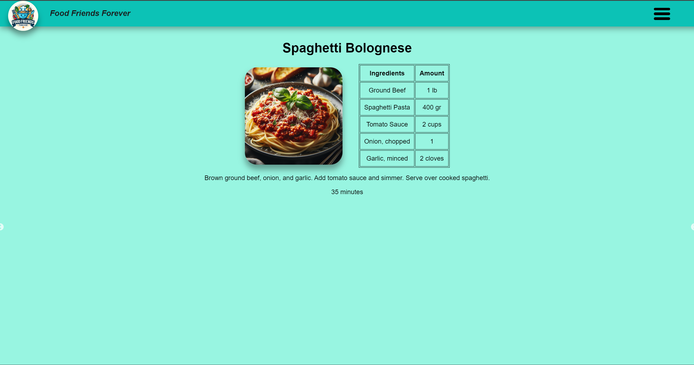
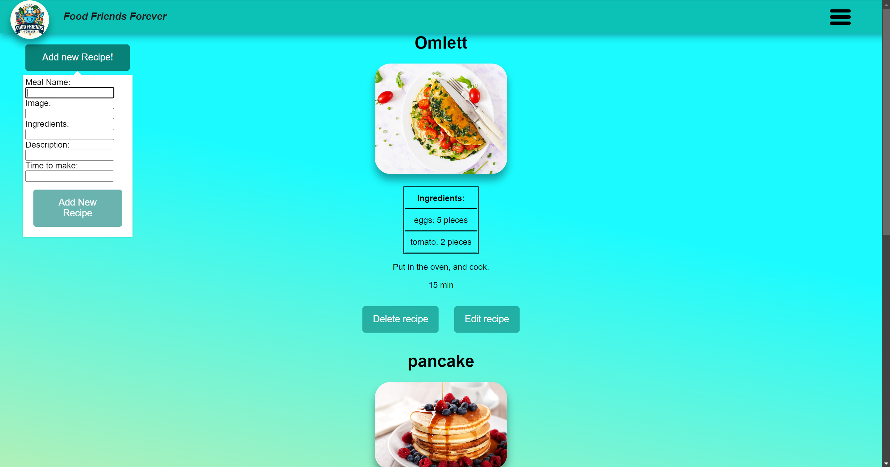
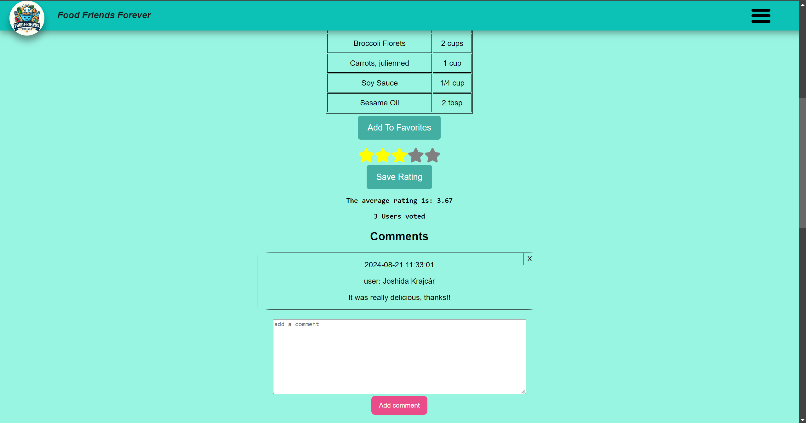

# MERN stack Recipe project

The Recipe Storage Application is a full-stack web application developed using the MERN stack (MongoDB, Express.js, React, and Node.js). It allows users to register, upload recipes, search for recipes, save their favorite recipes, add comments to others' recipes, and use a feature called "What is in my fridge" to find recipes based on available ingredients. The application also includes pagination and a rating system for recipes.

This project was developed by a team of five. Each team member contributed to all aspects of the project, from backend development, database management to frontend design.
*This project was developed after 6 months of studying coding.*

Developed by:

- [Eszter Fodor](https://github.com/eszti9902)
- [Brigitta Zsugonics](https://github.com/zsbrigi)
- [Roland Keszeg](https://github.com/keszegroland)
- [Andor Margitics](https://github.com/mrgitics)
- [Vazul Magyar](https://github.com/Vazul15)

## Features
- **User Registration**
- **Recipe Management**
- **Favorite Recipes**
- **Moving pagination:**
    - Detail: Displaying recipes with moving pagination on the main page.
    - Visual: 
- **Profile page:**
    - Detail: Displaying own recipes and uploading form for it.
    - Visual: 
- **Comments and rating:**
    - Detail: Add and view comments on recipes, and ratings.
    - Visual: 
- **"What is in my fridge":**
    - Detail: Find recipes based on ingredients entered.
    - Visual: 

## Technologies Used
- **Backend:** Node.js, Express.js
- **Frontend:** React
- **Database:** MongoDB
- **Libraries:** Mongoose (for MongoDB), React Router (for routing).

## Architecture
The application is structured into three main components:

- ### Frontend:
Built with React, this part handles the user interface and interactions.

- ### Backend:
Built with Node.js and Express.js, this part manages the API and handles data processing.

- ### Database:
MongoDB is used to store user and recipe data.

## Setup and Installation
- **Clone the repository to a desired directory:** `git clone git@github.com:CodecoolGlobal/freestyle-mern-project-2-react-zsbrigi.git`
- **Navigate to the project directory:** `cd <directory>`
### Backend Setup:
- **Navigate to the backend directory:** `cd server`
- **Install dependencies using npm:** `npm install`
- **Create .env files for the database in backend with the following variables:** `URL='mongodb+srv://<username>:<password>@<cluster>.mongodb.net/Recipes'`
- **Start the backend server:** `npm run dev`
### Frontend Setup:
- **Navigate to the frontend directory:** `cd ../client`
- **Install dependencies using npm:** `npm install`
- **Start the React development server:** `npm start`